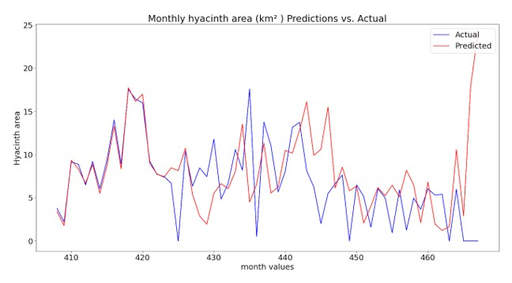

## The main features of this package are:

This repository allows for training and prediction of Hyacinth acreage values(in km²) using an LSTM approach. LSTM refers to a type of artificial neural network called **_long short-term memory_** networks, which is used in deep learning. These networks, which are a specific type of recurrent neural network, have the ability to learn and understand patterns in sequences over an extended period of time, and are particularly useful for solving sequence prediction problems.

<br />

## Requirements

- Python >=3.0 and <=3.7
- keras == 2.2.4
- pandas == 1.1.3
- seaborn == 0.11.0
- numpy == 1.21.6
- matplotlib == 3.5.2

<br />

## Parameters

- input_file - aggregated data in a .csv file.
- saved_model_folder - path to folder that will contain generated weights
- epoch - the number of iterations that should occur for every batch
- batch size - The size of the samples that should be processed before model weights are updated
- no_of_past_records - number of records that the model has to "look back" to predict during training
- no_future_records - number of records that the model has to predict in the future during training.
- future_prediction - Number of records that will overally be predicted and plotted
- from_duration, to_duration -number of future records that will be used to verify the accuracy of the model

## Training

"train_lstm" is the first function to use.
<br />
After specifying parameters such as batch size, epoch and where the model will be saved, the function "train_Lstm" calls function "data_prep" to create the required input and output sequcnces.
<br />
These sequences are then fed into an LSTM architecture and the end results include:

- weights in a hdf5 file
- plot showing training vs validation loss

```python

input_file=r'D:\...\Winam_Gulf_Satellite_Data.csv'
saved_model_folder=r'D:\...\weights'

#to train the model
saved_model=train_lstm(input_file, saved_model_folder,epoch=1000,batch_size=24,no_past_records=30,no_future_records=1)
```

## Prediction

After training of the network, two functions are explicitly called.
<br />

### data_prep function

The `data_prep` function ensures that the input file follows the same sequence to allow for proper unscaling of the data

```python

input_file=r'D:\...\Winam_Gulf_Satellite_Data.csv'
data_x,data_y=data_prep(input_file,no_past_records=30,no_future_records=1)
```

### predict_lstm function

This function uses the model weights created by the "train_lstm" function to predict for future input sequences.

```python

input_file=r'D:\...\Winam_Gulf_Satellite_Data.csv'
saved_model_folder=r'D:\...\weights'

#to train the model
file_name=os.listdir(saved_model_folder)
saved_model=saved_model_folder+"/"+file_name[0]

predict_lstm(input_file,saved_model,data_x,data_y,future_prediction=60,from_duration=0, to_duration=10)
```

The prediction will cover the last 60 records (two months) in the input_file dataset.

The "from_duration" and "to_duration" give you flexibility when it comes to evaluating the accuracy of the model between certain ranges.

Normally, it performs at small durations and deteriorates as one moves closer to the "to_duration" variable.

NB: "from_duration" and "to_duration" should not be greater than the "future_prediction" vaiable.

## Sample results



<br />

## License

Copyright: ©AET 2022

Supported by the International Sustainability Academy (ISA), Hamburg - Germany

<br />

## Contact

Caleb Masinde: ***caleb.masinde@motor_ai.com*** / ***calebjuma27@gmail.com***

Eric G Kariuki: ***gathirwa@aquaethanol.co.ke*** / ***ericgathirwak@gmail.com***
