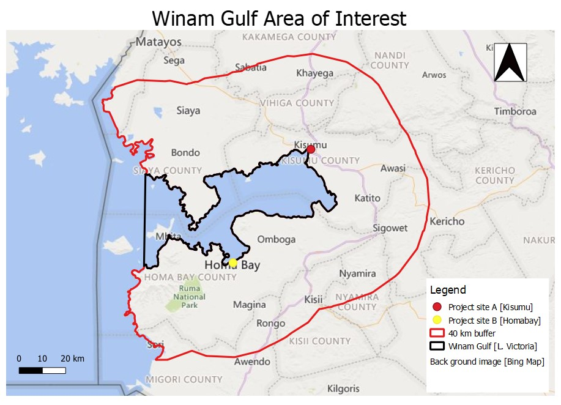
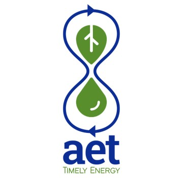
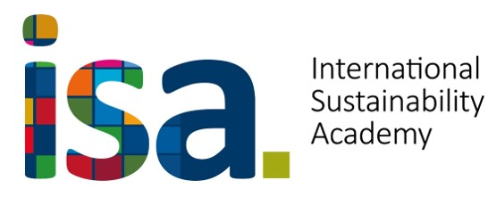

## Area of Interest

The Winam Gulf, a portion of Lake Victoria within Kenya.
 

 

## Objectives

The objective of this project was to analyze:

- satellite imagery and monitor changes in the Winam Gulf and its littoral area between 1984-2022,
- to build the Hyatrak model that can forecast the distribution and growth of water hyacinth.

 

The model will assist in preventing negative impacts caused by water hyacinth and support the sustainable use of the invasive plant in the production of biofuels and biorenewables.
 

## Notes

Aquaethanol Technologies (AET) is responsible for this project.

AET will test the Hyatrak predictor as a pilot project, and if successful, optimize and upscale the use of the model to other regions experiencing ecological challenges caused by water hyacinth encroachment globally.

## Support

This project was supported by the International Sustainability Academy (ISA), Hamburg, Germany.

